# Cargo Hunters Save Editor 🛠️
### *The Ultimate Save Management & Companion Suite for Cargo Hunters*

**English** · [Русский](README.ru.md)

Desktop save editor, interactive database & wiki for the Steam game **Cargo Hunters** (`offline.save`, Steam App ID `4197990`) built with Python and Tkinter.

[](LICENSE)

---

## ☕ Support the Project

If you find this tool helpful and want to support its continued development:

* ☕ **[Buy me a coffee on Ko-fi](https://ko-fi.com/sirnr1)**
* ⭐ **Star this repository** on GitHub to help others find it!

---

## 📸 Screenshots

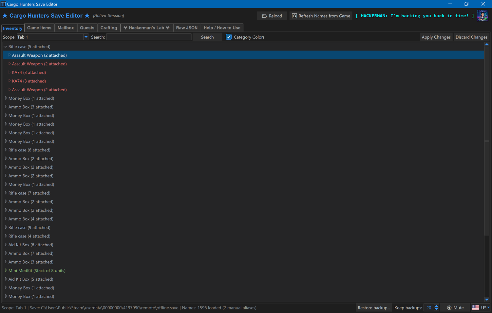

| Game Items catalog | Hackerman's Lab |
| --- | --- |
| 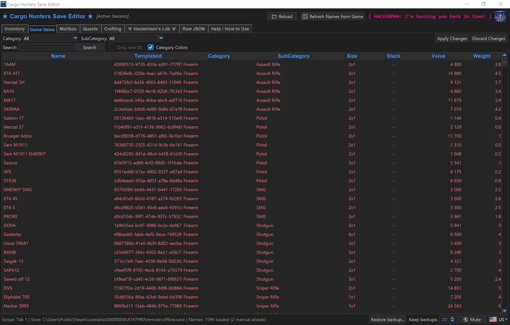 | 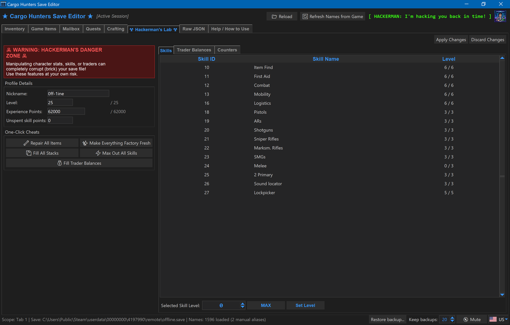 |

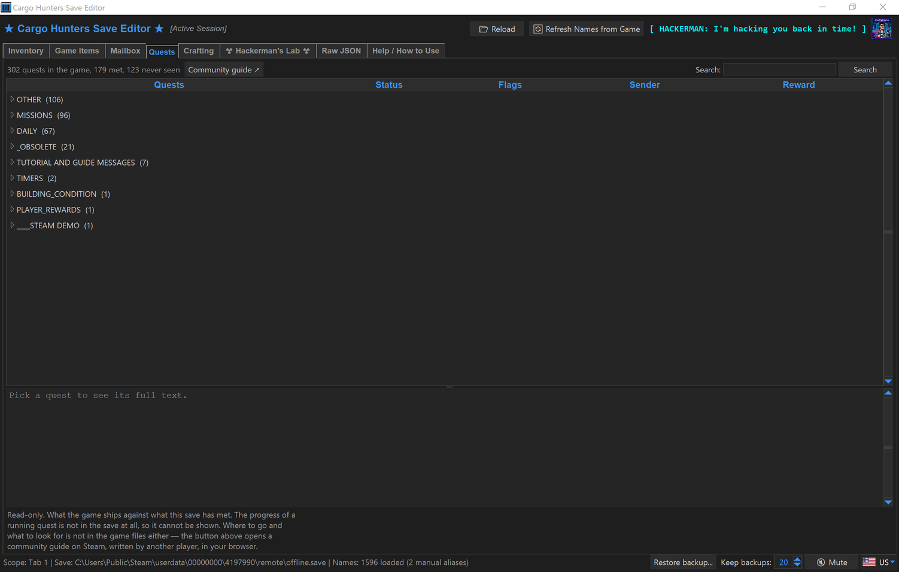

| Crafting | Search |
| --- | --- |
| 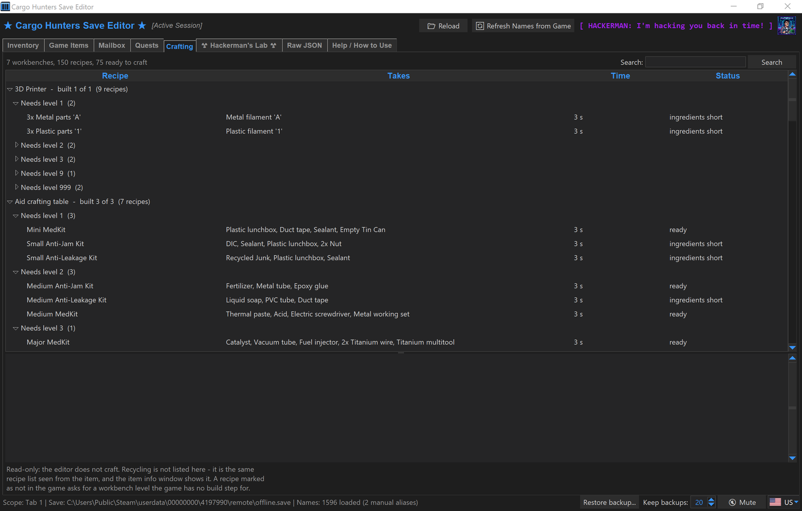 | 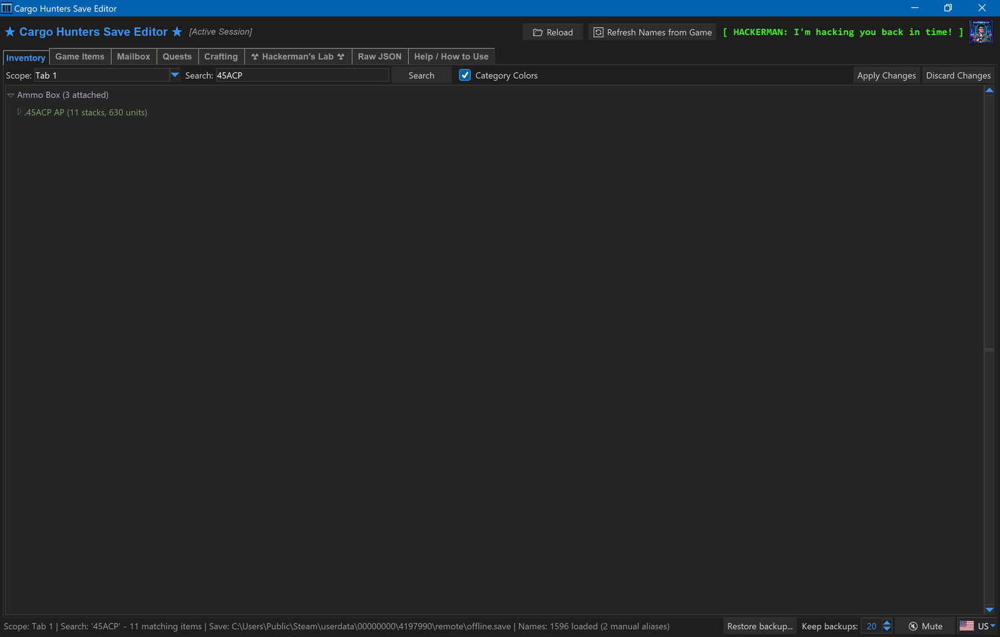 |

| A grouped row, opened | Factory fresh |
| --- | --- |
| 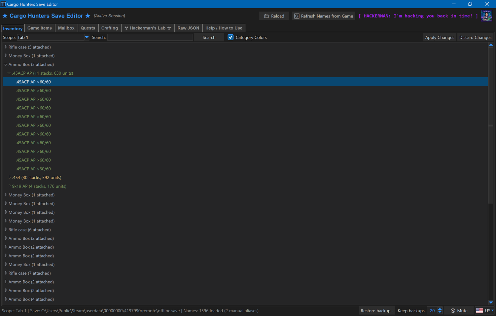 | 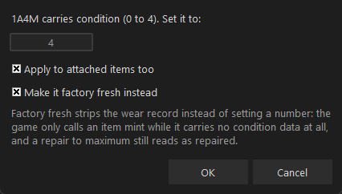 |

| Mailbox | Counters |
| --- | --- |
| 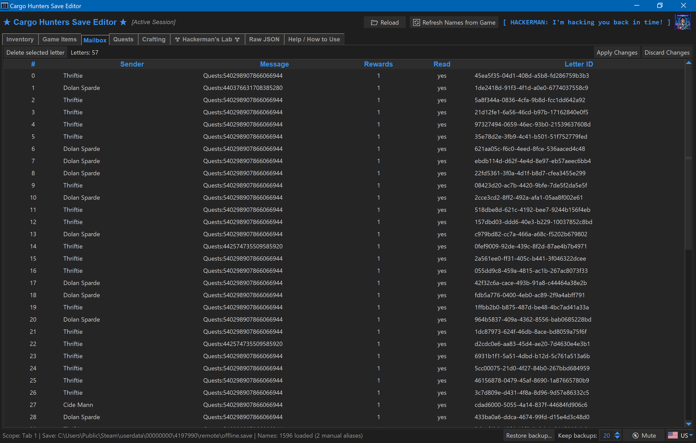 | 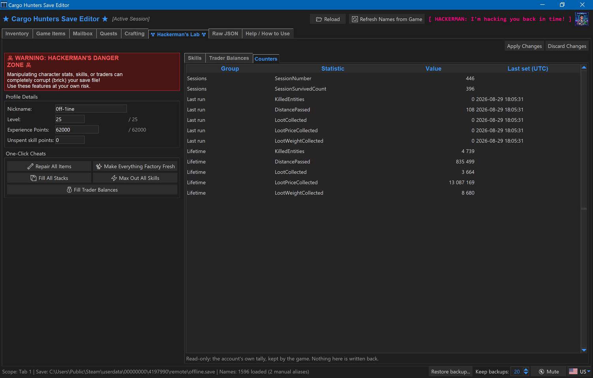 |

| Item info | Attachments |
| --- | --- |
| 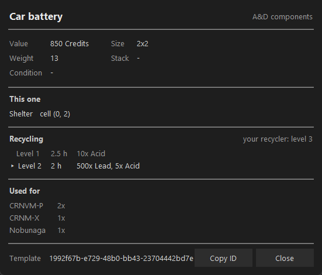 | 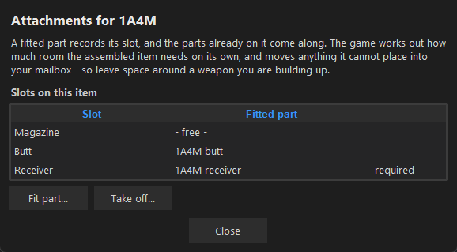 |

| The change list before writing | Offer at Trader |
| --- | --- |
| 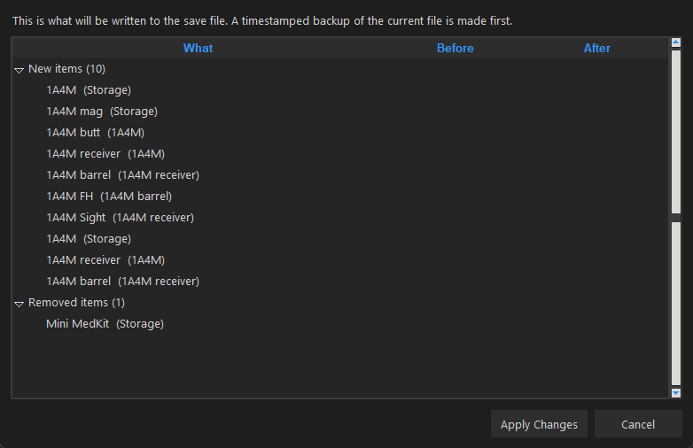 | 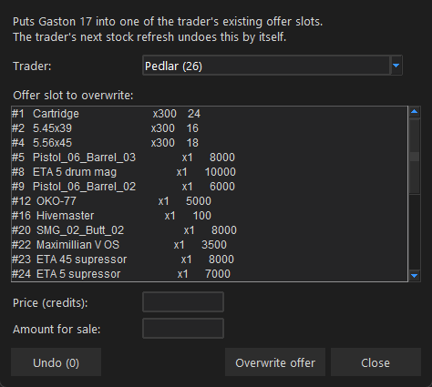 |

---

## ✨ Features

* **🎒 Inventory & Equipment Management**:
  * Edit items across character equipment, shelter containers, and inventory tabs.
  * Stack-aware duplication (+ copy count).
  * Recursive item repair (weapons, durability, condition metrics).
  * **Repair Item to...** sets a value of your choosing instead of the maximum, and holds each item to **its own** ceiling — 250 is right for a shield and nonsense for a five-charge repair kit, so one value across a whole weapon does not overshoot on the small parts.
  * **Factory fresh**, a tick in that same window and a one-click button for the whole save. It does the opposite of setting a number: it **removes** the wear record — the condition, the condition the item arrived with, and the charges. That is what the game means by mint, and a repair to the maximum is not it: the game shows an untouched DORA with no condition data at all, while a rifle repaired to full sits at the maximum and still reads as repaired. An item that is already fresh says so instead of doing nothing.
  * **Set Stack Size...** writes how many units a stack holds, up to what that item can carry. No free cell needed, unlike duplicating, and a value outside the range is refused rather than quietly cut down. Items the game never stacked stay unstacked.
  * **A grouped row opens.** `12x70 AP (10 stacks, 200 units)` is ten separate items, and each one is now a row of its own underneath — so anything you do there applies to that one stack instead of asking you to pick a number from a list you cannot see.
  * **Move Item...** takes an item to another container. Attachments come along, and an equipped item leaves its slot empty.
  * **Split Stack...** takes part of a stack into a second one, defaulting to half. At least one unit stays behind, since taking all of them is a move rather than a split.
  * **Attachments...** fits parts into an item and takes them off again. One window shows the slots on this item with whatever sits in each, and — for a part — the items of yours it fits into, so a scope can go straight from one rifle onto the next. A free slot offers exactly the parts the game allows there, out of what you own. Weapons, weapon parts, body parts and helmets all have slots.
  * **Search** filters the tree by name, category or id. A hit inside a container brings the container along and opens it, so a sight sitting in a weapon in a rifle case is visible where it is. An empty box shows everything again.
  * Delete an item together with everything attached to it — or expand it and delete a single attachment, so a scope goes without touching the rifle.
* **🔍 Item Info**:
  * Right-click → **Item Info**, in the inventory and in the catalog both. Read-only.
  * Value in credits, weight, grid size (with the maximum for a weapon that grows), stack capacity, and which kind of condition the item can carry. From the inventory it also shows that particular one's condition, count and location.
  * **What recycling yields.** The output depends on how far your Recycler is built, so every stage is listed and the one you can actually reach is marked:

    ```
    Recycling                                    your recycler: level 1
      ▸ Level 1    2.5 h    10x Acid
        Level 2    2 h      500x Lead, 5x Acid
    ```

    Your Recycler's level is read from your save. If every recipe needs a better module than you have, it says so rather than marking a row you cannot use. 426 of 1595 items can be recycled at all; the rest say plainly that they cannot.
  * **What the item is used for** — the recipes it is an ingredient in, with how many units each wants. Worth a look before scrapping something.
  * **Which ammunition a gun takes**, and the other way round: open a cartridge and it names the weapons chambered for it. 36 weapons and 95 cartridges across 14 calibers, and every weapon has a match.
  * **Where a part goes**, as a tree: a muzzle device fits the barrel, the barrel fits the receiver, the receiver fits the gun. Open the part instead and it names the **guns** it ends up on rather than the receiver in between. Body parts and helmets too — an arm shows its hydraulics and structure, a visor names its helmet.
* **📍 Choose Where a New Item Goes**:
  * Duplicating and spawning both ask first, and list every container: `Tab 1 - 73 of 240 cells free`, `Hugger (carried) - 22 of 24`. The window says how much room the item needs — `Space needed: 5 x 3 cells` — so the size is where the decision is instead of back in the catalog, and a container that cannot take *this* item is **marked rather than hidden**: you keep the overview and the choice, and the question is answered before you make it rather than after. The free count is what the search can really use, the room kept clear around growable neighbours included.
  * A free spot is then searched for inside that container, turning the item 90° only if it fits no other way. Spawning ten looks for ten spots, and says so if only part of the batch fits.
  * **Inbox** is always offered, also when everything is full — the game hands the item to you as mail.
  * The **shelter** is not offered: the game files do not describe its grid, so the editor does not guess at its size.
  * **Weapons need room, and they need their parts.** A weapon blocks more space than it is drawn at — a pistol shown as 2x1 can hold four cells — so the editor keeps that room clear instead of dropping something into space the game considers taken. It does that **only around weapons that can still grow**: once the game has written a weapon its finished size, that size is what it blocks, and holding its maximum clear on top of it would reserve for growth already behind it. In one real warehouse tab that gave back 15 of 29 usable cells. It also gives a weapon spawned on its own the parts it cannot exist without, like a slide or a receiver. Without either, the game hands the weapon straight back as mail.
* **📦 Full Game Items Catalog**:
  * Browse the complete extracted item database by category.
  * Add catalog items directly into your inventory.
  * Stackable items are spawned as real stacks; the **Stack** column shows how many units fit in one.
  * Items that can wear out get one more field when spawned: the condition they start at. Left at the maximum they are spawned pristine, which is how the game stores an untouched item — it carries no condition field at all.
  * **What a game update brought is marked.** After *Refresh Names from Game* the items that are new since the last refresh are drawn in magenta, and **Only new (N)** next to the search filters some 1600 rows down to them — a colour alone would mean scrolling to find three dozen. The mark outlives closing the editor, because that is usually when the question comes up, and the next refresh replaces it with whatever *that* one brought. A first run marks nothing on purpose: with no earlier mapping to compare against, all 1600 items would count as new, which answers nothing.
  * **Value** and **Weight** columns, straight from the game data. 1110 of 1595 items have a price and 1162 a weight; the rest show a dash rather than a zero, because "no price recorded" and "costs nothing" are different statements.
  * **Spawn a weapon fully assembled**, the way the game ships it: right-click → **Spawn assembled...** and pick a configuration. 53 of them, covering 35 weapons with one to seven parts each, taken from the game's own preset list — the loot tables that leave anything to chance are left out rather than rolled for you. 17 configurations add up to more than their weapon is allowed to grow to, and the editor says so before spawning instead of letting the game answer with mail. The room it looks for is the **finished** size plus a cell, not the maximum the template could reach: measured against the weapons the game itself assembles, none is taller than two cells or wider than five, while asking for the maximum meant up to 7x4 — nine times the area for a rifle the game stores at 3x1.
* **🤝 Trader Stock Swapping**:
  * Temporarily place any catalog item into a trader's shop stock for purchase in-game.
  * Reverts when the trader's stock refreshes in-game, or immediately via the dialog's **Undo** button (current editor session only).
* **📬 Mailbox Manager**:
  * View inbox messages, reward counts, read states, and NPC senders (`NpcBioId` resolution).
* **🗺️ Quests (read-only)**:
  * Every quest in the game against the ones your save has met — **302 against 179** in a real save, which is the point: a save only ever names the quests you have already come across, so the ones you have not can only come from the game's own files.
  * Grouped the way the developers group them, and inside that by active, completed, or never seen. The never-seen branches start open, so the question is answered when you open the tab. Pick one and the panel below shows the full briefing, what it wants finished first, who sends it, and what it pays.
  * Two caveats: **67 of the unseen ones are daily quests** from a rotating pool and 21 are marked obsolete — cut content that cannot appear. And **progress is not shown**, because it is not in the save: the game stores what a quest wants but not how far along you are.
  * **Search** across the name, the briefing text, the sender, the group and the id — half a remembered line from a letter is enough to find the quest it came from.
* **🔧 Crafting (read-only)**:
  * Every workbench recipe in the game — 150 of them across seven shelter modules — with what it takes, what it makes, and how long it runs.
  * Your own store is counted against each one, so a recipe reads **ready**, **ingredients short**, **level too low**, or **not in the game yet**. The last one is real: some recipes ask for a workbench level the game has no build step for.
  * The Recycler's own 976 recipes are not repeated here; they are in **Item Info**, per item, where the question is what you get for something.
  * **Search** matches the module, the recipe name, what it makes — and what it consumes, so typing an ingredient answers the other question: not how to make a thing, but what the pile of scrap in your bag is good for.
* **☢️ Hackerman's Lab**:
  * Edit nickname, character level, XP, individual skill levels, trader shop levels, and balance.
  * Every ceiling is read from the game's own data instead of a hardcoded number: each skill has its **own** maximum (the `MAX` button uses it), the character level stops where the game stops, and a trader's balance stops at what that shop is allowed to hold — writing more than the game accepts just gets cut down silently on the next load.
  * XP is capped at the current level's goal, which is shown next to the field. Set the level first; changing it resets XP to 0.
  * **Unspent skill points** can be added, and are deliberately not capped.
  * A **Counters** sub-tab shows the account's sessions, last run and lifetime tallies, read-only.
  * Five one-click buttons: **Max Out All Skills**, **Fill Trader Balances**, **Repair All Items**, **Fill All Stacks** — every partial stack up to what its item can carry — and **Make Everything Factory Fresh**, which strips the wear record off the whole save. The last two ask first and say afterwards how much they touched; like every other edit, nothing is written until you apply.
* **🛡️ Safe Staging & Auto-Backup**:
  * Edits are staged in memory.
  * **Apply Changes shows the list first and waits for a yes.** Every added item, every removed one, every changed field, grouped and named — and because it compares against the file on disk rather than against what the editor read at startup, it also catches what the game changed in the meantime. Cancel and nothing is written. The same list appears **before a restore**, saying what putting that backup back would undo, and on demand as a **comparison between your save and any backup**.
  * **Apply Changes** saves to disk while creating a timestamped backup in the `backups/` directory.
  * **Discard Changes** reverts pending edits to the last saved state.
  * **Keep backups** in the bottom right caps how many are kept — 20 by default, 0 keeps every one. Only files the editor named itself are ever deleted, so your own copies in that folder are safe.
  * **Restore backup...** next to it puts one back without leaving the editor: pick it from the list by timestamp, reason and size, and the editor replaces your save and reloads. Your current save is copied aside as `before_restore` first, so undoing the undo is one more click. A file the editor did not write itself is never offered, and a pick that turns out not to be a save is refused **before** your save is touched rather than halfway through.
  * **Reload Save** at the top right reads the file again while the editor stays open. The game writes your save when a raid ends, so an editor left open beside it shows a state one raid old — this catches up without a restart. Unsaved changes describe the version being replaced and cannot come along, so you are asked first.
  * Auto-detects Steam `offline.save` files on Windows and Linux.
* **🌍 Multi-Language Support (i18n)**:
  * English, German (Deutsch), and Russian (Русский).

---

## 🚀 How to Run from Source

### Requirements
* Python 3.11+
* `tkinter` (included with standard Python installers on Windows)
* `UnityPy` — optional, and only for **Refresh Names from Game**, which re-reads item and NPC
  names from the game's asset bundles. A prebuilt mapping ships with the app, so everything
  else works without it.

```bash
pip install UnityPy   # only if you want to refresh the names yourself
```

### Run Command

```bash
python CH_Editor/gui_editor.py
```

Optional explicit save path:

```bash
python CH_Editor/gui_editor.py --save-path "/path/to/offline.save"
```

---

## 🔨 Building Portable Windows Executable (`.exe`)

You can build a standalone portable `.exe` folder using PyInstaller:

```bash
pip install pyinstaller UnityPy
pyinstaller cargo_hunters_editor.spec
```

The compiled portable app will be located at:
`dist/CargoHuntersEditor/`

---

## ⚠️ Windows will warn you the first time

The build is an unsigned PyInstaller executable, so two warnings are normal and neither means
something is wrong:

* **SmartScreen** — *"Windows protected your PC"*. Click **More info → Run anyway**. The
  warning appears because the file has no code-signing certificate, not because of anything
  it does.
* **Antivirus** — PyInstaller executables are a well-known source of false positives, since
  legitimate and malicious programs alike get packed with it. Defender occasionally flags one
  build and clears the next.

The app makes no network connections. The only files it writes are your save and the
timestamped copies in the `backups/` folder next to the executable.

If you would rather not trust a binary at all, run it from source — it is the same code, and
the section above tells you how.

---

## 📄 License & Terms

This project is licensed under the **[GNU General Public License v3.0](LICENSE)** (GPLv3).

* **Open Source**: You may freely use, modify, and distribute this software.
* **Copyleft**: If you distribute modified versions of this software, you must release your changes under the same GPLv3 license and provide the source code.
* **Keep the notices**: You must include the original copyright notice and a copy of the license with any distribution.

### Disclaimer
*This software is an unofficial, community-made fan tool and is NOT affiliated with, endorsed by, or associated with the developers or publishers of Cargo Hunters.*
